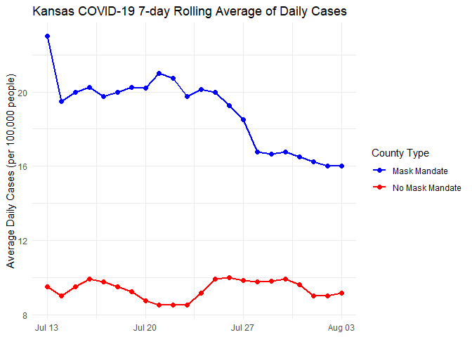
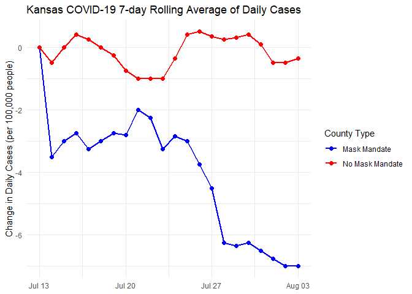

Lab 07 - Conveying the right message through visualisation
================
Insert your name here
Insert date here

### Load packages and data

``` r
library(tidyverse) 
```

    ## Warning: package 'tidyverse' was built under R version 4.4.3

    ## Warning: package 'purrr' was built under R version 4.4.3

### Exercise 1

``` r
library(tibble)
library(ggplot2)

df <- tribble(
  ~date, ~mask_count, ~nomask_count,
  "7/13/2020", 23, 9.5,
  "7/14/2020", 19.5, 9,
  "7/15/2020", 20, 9.5,
  "7/16/2020", 20.25, 9.9,
  "7/17/2020", 19.75, 9.75,
  "7/18/2020", 20, 9.5,
  "7/19/2020", 20.25, 9.25,
  "7/20/2020", 20.2, 8.75,
  "7/21/2020", 21, 8.5,
  "7/22/2020", 20.75, 8.5,
  "7/23/2020", 19.75, 8.5,
  "7/24/2020", 20.15, 9.15,
  "7/25/2020", 20, 9.9,
  "7/26/2020", 19.25, 10,
  "7/27/2020", 18.5, 9.85,
  "7/28/2020", 16.75, 9.75,
  "7/29/2020", 16.65, 9.8,
  "7/30/2020", 16.75, 9.9,
  "7/31/2020", 16.5, 9.6,
  "8/1/2020", 16.25, 9,
  "8/2/2020", 16, 9,
  "8/3/2020", 16, 9.15,
)

df_long <- df %>%
  pivot_longer(cols = c(mask_count, nomask_count), 
               names_to = "category", values_to = "count")
```

### Exercise 2

``` r
ggplot(df_long, aes(x = as.Date(date, format="%m/%d/%Y"), y = count, 
                    color = category, group = category)) +
  geom_line(size = 1) +  
  geom_point(size = 2) +  
  labs(title = "Kansas COVID-19 7-day Rolling Average of Daily Cases",
       x = NULL,  # Correct way to remove x-axis label
       y = "Average Daily Cases (per 100,000 people)",
       color = "County Type") + 
  scale_color_manual(values = c("mask_count" = "blue", "nomask_count" = "red"),
                     labels = c("mask_count" = "Mask Mandate", 
                                "nomask_count" = "No Mask Mandate")) +  
  theme_minimal()
```

    ## Warning: Using `size` aesthetic for lines was deprecated in ggplot2 3.4.0.
    ## ℹ Please use `linewidth` instead.
    ## This warning is displayed once every 8 hours.
    ## Call `lifecycle::last_lifecycle_warnings()` to see where this warning was
    ## generated.

<!-- --> \### Exercise
3 In my plot it is more clear that counties with mask mandates have
higher daily averages compared with counties without mask mandates. In
the original visualization the different scales for the y axis make it
look as if there were lower daily averages in counties with mask
mandates. The original visualization is misleading because it does not
convey what the data shows.

### Exercise 4

This data simply shows that counties that have mask mandates have higher
daily averages compared with counties that do not have mask mandates.
This data does not show that mask mandates are ineffective because the
daily averages could be the cause of other factors (e.g. population
density)

### Exercise 5

The message conveyed by my plot is that counties with mask mandates have
higher daily averages compared with counties without mask mandates. This
is shown through using the same y axis for both lines. Also the legend
is clearer compared to the first plot, making it easier to tell which
line represents which category. Furthermore, the initial plot seems
purposefully misleading with how it shifts the y axis scales to make it
seem like counties with mask mandates have lower daily averages.

### Exercise 6

For a plot to convey the opposite message that would mean that it would
seem that the mask mandate counties have lower daily averages compared
with counties without mask mandates.

To do this, i could instead focus on the changing rates rather than the
averages because the mask mandate counties have a higher rate of change
compared with the counties without mask mandates. This would make it
seem like the mask mandate counties have lower daily averages compared
with counties without mask mandates.

### Exercise 7

``` r
library(dplyr)

df_long <- df_long %>%
  arrange(category, as.Date(date, format="%m/%d/%Y")) %>%  
  group_by(category) %>%  
  mutate(first_day_count = count[date == "7/13/2020"],  
         change_from_first = count - first_day_count) %>%  
  ungroup()
```

``` r
ggplot(df_long, aes(x = as.Date(date, format="%m/%d/%Y"), y = change_from_first, 
                    color = category, group = category)) +
  geom_line(size = 1) +  
  geom_point(size = 2) +  
  labs(title = "Kansas COVID-19 7-day Rolling Average of Daily Cases",
       x = NULL,  # Correct way to remove x-axis label
       y = "Change in Daily Cases (per 100,000 people)",
       color = "County Type") +  
  scale_color_manual(values = c("mask_count" = "blue", "nomask_count" = "red"),
                     labels = c("mask_count" = "Mask Mandate", 
                                "nomask_count" = "No Mask Mandate")) +  
  theme_minimal()
```

<!-- -->

This plot has change in daily cases on the y axis and date on the x
axis. The change is the difference from the first day. Because the mask
mandate counties have a higher rate of change compared with the counties
without mask mandates, it makes it seem like the mask mandate counties
have lower daily averages compared with counties without mask mandates.
This plot conveys the opposite message compared to the accurate plot.
